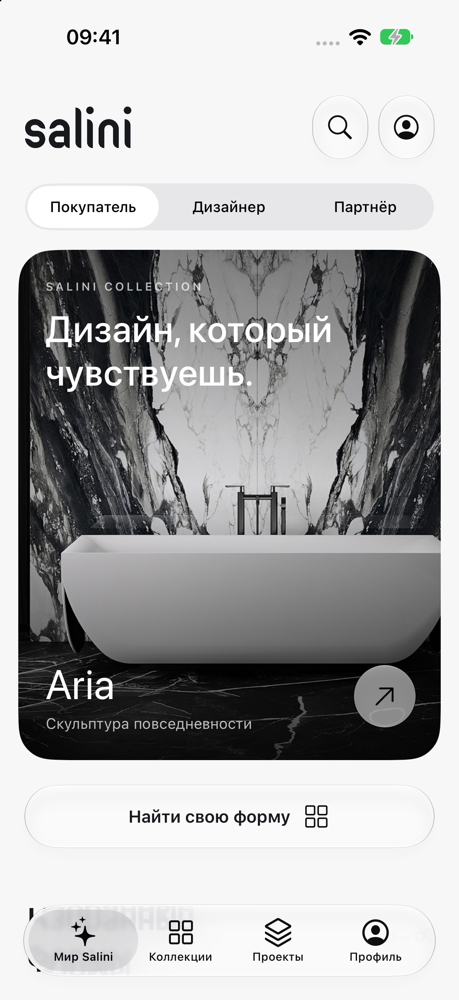
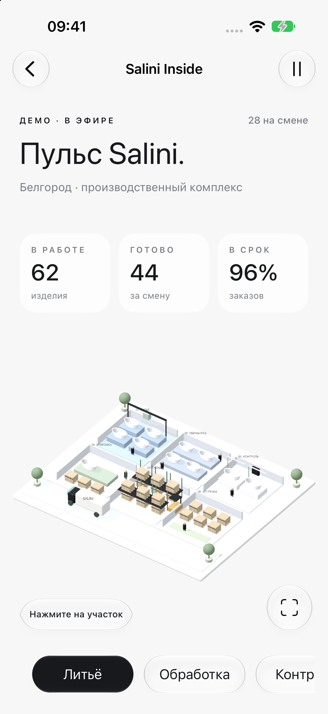

# Salini Experience

Нативный интерактивный прототип для iOS 27. UIKit, системные `UIGlassEffect` и glass button configurations, `UITabBarController`, SceneKit. Без WebView и сторонних зависимостей во время выполнения.

Приложение сразу открывает главную. Переключатель «Покупатель / Дизайнер / Партнёр» встроен в лендинг и меняет контекст главной. Используются оригинальный логотип и изображения Salini, нейтральные поверхности, графитовая типографика и системное стекло.

## Что можно попробовать

- Главная, режимы аудитории, коллекции и поиск по имени/артикулу.
- Aria: S-Sense 790 000 ₽ и S-Stone 890 000 ₽, соответствующие артикулы, чертёж PDF, избранное.
- Проект: разные конфигурации, количество, удаление, переименование и экспорт PDF через системное меню.
- Профиль → **Salini Inside**: объёмная модель производства, шесть выбираемых участков, транспорт и сотрудники, события каждые пять секунд, пауза, заказ, приоритет, назначение контроля и демонстрационная камера.

Владелец открывается через профиль, не через выбор аудитории на главной. На главной также есть быстрый вход в профиль справа от поиска.

## Вид приложения





## Сборка

Открыть `Salini.xcodeproj`, выбрать схему `Salini` и симулятор iOS 27. Подписание для Simulator отключено. Для реального устройства потребуется своя команда разработчика и настройка подписи.

```sh
cd ios
xcodebuild -project Salini.xcodeproj -scheme Salini \
  -destination 'platform=iOS Simulator,name=Salini — iOS 27' \
  -derivedDataPath .build build
```

Сгенерированный проект включён в Git. `xcodegen generate` нужен только при изменении `project.yml`. `prepare_assets.py` пересобирает подборку из локального исследовательского архива; готовые ресурсы уже включены в проект и не требуют этого шага.

## Достоверность данных

Каталог содержит четыре реальных изделия из публичного сайта, снимок 6 октября 2026. Источники изображений перечислены в `ASSET_SOURCES.json`; права на материалы принадлежат Salini/их владельцам, лицензия кода не распространяется на них. Оригинальный логотип преобразован из SVG в PNG, в интерфейсе применяется монохромный tint без изменения геометрии знака.

Схема цеха, заказы, сотрудники, счётчики, события, транспорт и камеры **смоделированы**. Это демонстрация взаимодействия, не реальные показатели компании или точная планировка. Производственный поток адаптирован к литьевому камню: литьё, обработка, контроль, упаковка, склад и отгрузка. Внешние команды не отправляются; 1С и камеры не подключены. Сохранённые проекты и роль находятся в UserDefaults на устройстве.

## Проверки

```sh
xcodebuild -project Salini.xcodeproj -scheme Salini \
  -destination 'platform=iOS Simulator,name=Salini — iOS 27' \
  -derivedDataPath .build test
```

Проверяются соответствие цен/артикулов Aria, сохранение разных исполнений, восстановление проекта, пауза и история событий, идемпотентность изменения приоритета и загрузка экранов/изображений. Результаты ручной проверки Simulator записаны в `QA.md`.

Полное исследование находится в `../research/site-audit-2026-10-06/report/index.html`. Большой архив исходных страниц, PDF и изображений сохранён локально, исключён из Git. Инвентаризация с URL и контрольными суммами включена в репозиторий.
